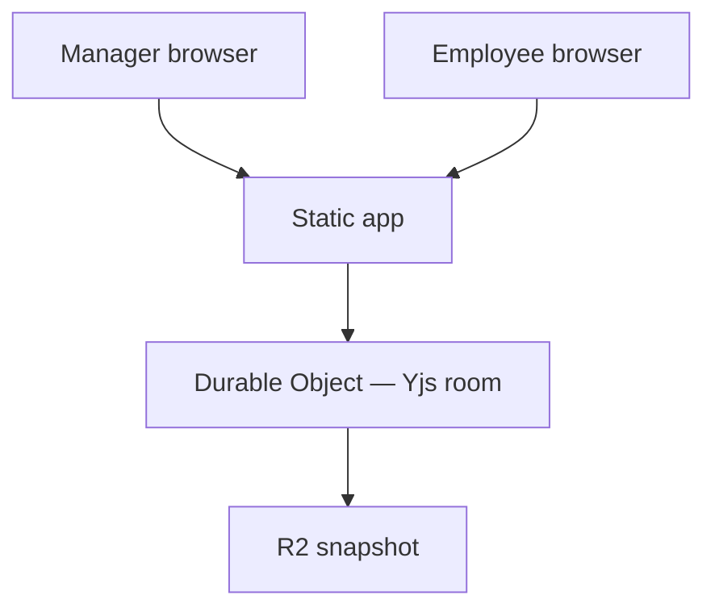

# Architecture

Reference document for hosting, collaboration, and distribution of the ManagerTools 1:1 workspace. Product behavior and UI are defined in [Design.md](./Design.md).

## Goals

- Two users (manager and employee) edit the same document in real time.
- Changes persist with cloud backup.
- The author does **not** host document content.
- Invited admins can stand up their own workspace instance.
- The author controls who may start an instance (not a public multi-tenant SaaS signup).

## Core constraint

Action items, goals, and meeting notes are personnel records. Running one shared Firebase, Supabase, Liveblocks, or similar backend under the author's account makes the author the data processor for every pair. That violates the constraint above.

**Publish the app as code. Each workspace owner deploys into a cloud account they own.**

## Recommended shape

Treat this as a **deployable workspace**, not a hosted SaaS. Design.md already describes the product model: an admin creates page instances and shares a password-protected link. The architectural decision is **who owns the database**: the invitee (manager / workspace admin), not the author.

| What the author publishes | Where pair data lives |
| --- | --- |
| GitHub repo, Figma-faithful UI, design tokens (`src/styles.json`), deploy recipe | The invitee's Cloudflare (or InstantDB) account |

One deploy can host **many** manager–employee pages. "Start an instance" means one manager workspace, not a separate deploy per employee.

## Runtime

Both editors load the same static client. Each 1:1 page is one Yjs document. A Durable Object is the live room for that page id. R2 holds periodic snapshots if the room is evicted.

## Two planes

### Control plane (author)

- GitHub repo with source code
- Figma design system components and tokens
- Wrangler config and Deploy to Cloudflare button (or private-repo import instructions)
- Access control: who gets the repo or deploy button

No 1:1 document bodies pass through the author's account.

### Data plane (workspace admin / invitee)

- Their Cloudflare project (recommended) or InstantDB app (alternative)
- Durable Objects, R2, password hashes, page metadata
- Optional: their own AI API key for admin summaries

They create pages, reset employee credentials, and manage settings per Design.md.

## Stack

| Layer | Choice | Rationale |
| --- | --- | --- |
| UI | Vite + React + TypeScript | Matches Figma components; static hosting; Google Fonts client-side |
| Design tokens | `src/styles.json` → CSS variables | Source of truth for component styling |
| Document | One Yjs doc per 1:1 page | Real-time for two editors; offline-capable; maps to action items, goals, agenda |
| Sync | Cloudflare Worker + Durable Object (SQLite backend) | Live room per page; isolated storage per object |
| Backup | R2 snapshots on idle | Survives Durable Object eviction |
| Share link | `/p/:pageId` + password | Admin creates page; employee opens protected URL |
| Auth | Admin password + employee page password | Per Design.md; no full SSO in v1 |
| AI summaries | Deployer's API key or Workers AI | Never embed the author's model key in a public client |
| Distribution | Private repo + Deploy to Cloudflare, or public repo + button | Author chooses who can start a workspace |

Do **not** mix Cloudflare deploy and BYO InstantDB in v1. Pick one data plane.

## Roles and access

| Person | Account they own | What they enter in this app |
| --- | --- | --- |
| Author | GitHub (code only) | Nothing in a user's workspace |
| Manager / admin | Cloudflare (Path A) or InstantDB (Path B) | Admin password; App ID only on Path B |
| Employee | None | Page password from the share link |

The employee never creates a Cloudflare, InstantDB, or GitHub account. They only open the link the manager sends.

After deploy, "signed in as admin" means the **workspace admin password** validated by their Worker — not a Cloudflare or Google session inside the 1:1 page.

## Attaching to an account they own

Attach is a one-time bind: this copy of the app reads and writes **their** backend. The app does not log the manager into the author's account.

### Path A — Deploy to Cloudflare (recommended)

Ownership is the Cloudflare login used at deploy time. No API keys are pasted into the app UI.

Cloudflare's Deploy button:

- Requires a **public** GitHub or GitLab repository
- Clones the repo into the admin's GitHub account
- Provisions Worker, Durable Object namespace, and R2 from `wrangler` bindings
- Builds and deploys via Workers Builds

If the author must gate who can start an instance, keep the repo **private**, add the admin as a GitHub collaborator, and have them use **Workers & Pages → Import a repository** in the Cloudflare dashboard instead of the public Deploy button.

### Path B — Paste an app ID (if admins will not deploy)

The author hosts only the static JS. On first admin use, the panel asks for a backend the admin created:

1. Admin creates an InstantDB (or Firebase) app under their own account.
2. Admin copies the App ID (or Firebase web config).
3. Admin pastes it in the admin panel and sets a workspace admin password.
4. All reads and writes go to their backend. The author never sees document content unless the admin shares it.

Path B trades the one-click "this URL is their instance" story for a credentials-paste step.

## First Cloudflare project — admin onboarding

The new admin needs **two accounts**: GitHub (Cloudflare clones the template there) and Cloudflare (Worker + Durable Objects). No credit card is required for the Workers Free plan. SQLite-backed Durable Objects and a `*.workers.dev` URL are included. No custom domain in v1.

### One-click path (public template)

1. Create a GitHub account if needed; verify email.
2. Create a Cloudflare account at [dash.cloudflare.com/sign-up](https://dash.cloudflare.com/sign-up); verify email; enable 2FA (dashboard access can read their rooms).
3. Open the Deploy to Cloudflare button the author sends.
4. Connect GitHub, then connect Cloudflare. Accept or rename the cloned repo and Worker name.
5. Click **Deploy**. Cloudflare clones the repo, provisions resources, and builds.
6. Open the Worker URL (e.g. `name.account.workers.dev`). No DNS setup.
7. First visit in the app: set the **workspace admin password** (stored as a hash in their Worker).
8. Admin panel: create the first 1:1 page, set the employee password, copy the share link.

### Private-repo path (author chooses who)

1. Author adds the admin as a GitHub collaborator on the private repo.
2. Admin creates GitHub and Cloudflare accounts as above.
3. Cloudflare dashboard: **Workers & Pages → Create → Import a repository** → authorize GitHub → select repo → Deploy.
4. Same first-visit steps: open `*.workers.dev`, set admin password, create a page, share the employee link.

Admins should not need to run `wrangler`, paste API tokens, or create R2 / Durable Objects manually if the template's Wrangler config declares those bindings.

## Security and privacy

### Against other customers and the author

Yes — if the workspace admin deploys into **their own** Cloudflare account. The author cannot read documents in someone else's account. Each Durable Object's storage is private to that instance.

### Against Cloudflare (platform trust)

Not by default. Durable Objects and R2 use AES-256 at rest and TLS in transit. Encryption keys are Cloudflare-managed. Cloudflare can technically decrypt stored data and must produce it if legally compelled. Same trust model as AWS or Google Cloud — not Signal-style end-to-end encryption.

| Who | Can read 1:1 notes by default? | With browser encryption? |
| --- | --- | --- |
| Manager and employee (with page password) | Yes (intended) | Yes |
| Author | No (their Cloudflare account) | No |
| Other Cloudflare customers | No | No |
| Anyone with their Cloudflare dashboard access | Yes (deploy dump code, download R2) | Ciphertext only |
| Cloudflare staff / lawful process | Technically yes | No (ciphertext only) |
| Stranger with leaked link + password | Yes | Yes (password is the key) |

### Application security (our responsibility)

- Unguessable page ids
- Hashed passwords; never store plaintext secrets
- Rate limiting on auth endpoints
- No document bodies in logs
- HTTPS only

A password field with plaintext storage in the Durable Object is not "private" just because it sits on Cloudflare.

### Optional: client-side encryption

If managers need "Cloudflare cannot read this," encrypt the Yjs document in the browser with a key derived from the page password before it reaches the Durable Object. Cloudflare stores ciphertext only.

**Tradeoff:** lost password means lost document unless a recovery key is added for the manager to store separately.

### Infrastructure Cloudflare provides

- Per-object storage isolation
- Encryption at rest (LUKS / AES-256 for Durable Objects; AES-256 GCM for R2)
- SOC 2 / ISO-style attestations (Trust Hub)
- GDPR Data Processing Addendum
- Jurisdiction pinning for Durable Objects (e.g. EU) for data residency

## Approaches compared

| Approach | Author holds content? | Realtime + backup | Invitee effort | Verdict |
| --- | --- | --- | --- | --- |
| Cloudflare template | No | Yes, in their account | Click deploy | **Default** |
| Public SPA + BYO InstantDB | No | Yes, in their Instant app | Create app, paste ID | If invitees won't deploy |
| One Firebase / Liveblocks (author-owned) | Yes | Yes | Open a link | **Reject** |
| WebRTC only, no persistence | No | Realtime only, no backup | Open a link | **Reject** |

## Build order

Verify each step before starting the next. UI can ship locally with no backend; collaboration is a document-model problem, not a layout problem.

1. **UI** — Reusable Figma components, then the two-column page, bound to CSS variables from `styles.json`. Single-user, in-memory.
2. **Schema** — Yjs schema for action items, goals, agenda entries, local style overrides, and admin settings (due dates, hide completed).
3. **Local persistence** — IndexedDB so one person can refresh without a server.
4. **Sync** — Cloudflare Worker + Durable Object provider for the Yjs doc; R2 snapshot on idle. Two browsers, one page id.
5. **Auth** — Admin password, employee share-link password, credential recall/reset. Hash secrets; never store plaintext.
6. **Deploy template** — Wrangler config, Deploy to Cloudflare button, README for invitees.
7. **AI summaries** — Admin-only, using the deployer's key or Workers AI. Defer until rooms persist.

## Assumptions

- "Start an instance" = one manager workspace with many 1:1 pages (per Design.md), not one deploy per employee.
- Invitees can use a Cloudflare account; Workers Free tier is sufficient for pair documents.
- The author wants to choose who may start a workspace, not operate public signup.
- If any assumption is wrong, revisit the data plane choice (Cloudflare vs InstantDB vs other).

## Out of scope for v1

- Author-hosted multi-tenant backend
- Full SSO / OAuth for managers or employees
- WebRTC-only sync without cloud backup
- Mixing Cloudflare deploy and InstantDB in one product build
- Custom domains (use `*.workers.dev` initially)
- Client-side encryption (optional future enhancement unless required from day one)
